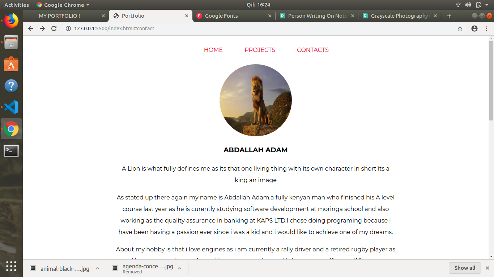
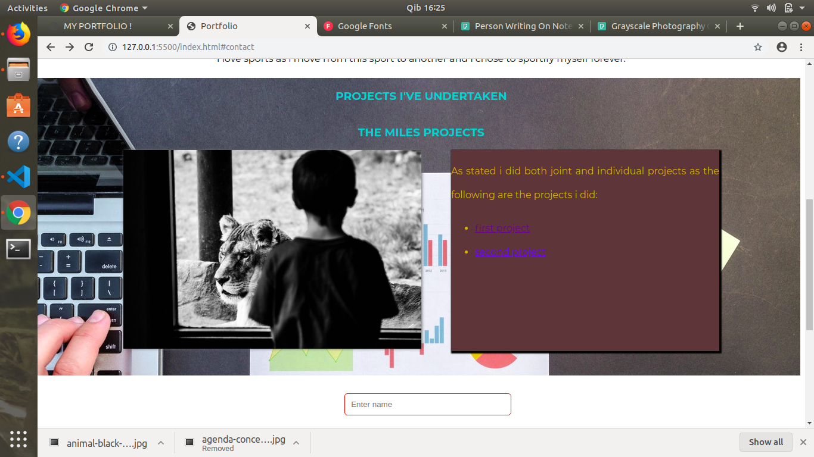
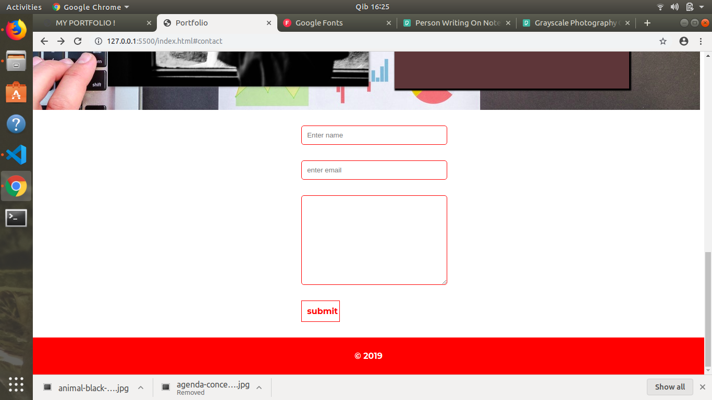

# PORTFOLIO WEBSITE

### AUTHOR

---

Anthony Ng'ang'a

---

### SCREENSHOTS

---






---

### DESCRIPTION

---

This is the first version of my portfolio website. Over the next few months it will be updated and made even better.

---

### LIVE LINK

---

You can find the live site at : https://mantongash.github.io/portfolio_v1/

---

### PROJECT SETUP

---

No special tooling is required for this project. You only need a text editor (e.g Visual Studio Code) to be able to run the website locally.

To clone the website for use locally, do the folowing:

In the commandline, enter;

```bash
git clone https://github.com/Mantongash/portfolio_v1.git
```

---

### TECHNOLOGIES USED

---

- HTML5
- CSS3

---

### KNOWN BUGS

---

At the time of publishing, this website was not responsive. That's bound to change though in a few weeks time.

---

### CONTACT DETAILS

---

For any queries or concerns, please don't hesitate to contact on ngash.anto@gmail.com.

---

### LICENSE

---

The MIT License (MIT)

Copyright (c) 2019 Anthony Ng'ang'a

Permission is hereby granted, free of charge, to any person obtaining a copy of this software and associated documentation files (the "Software"), to deal in the Software without restriction, including without limitation the rights to use, copy, modify, merge, publish, distribute, sublicense, and/or sell copies of the Software, and to permit persons to whom the Software is furnished to do so, subject to the following conditions:

The above copyright notice and this permission notice shall be included in all copies or substantial portions of the Software.

THE SOFTWARE IS PROVIDED "AS IS", WITHOUT WARRANTY OF ANY KIND, EXPRESS OR IMPLIED, INCLUDING BUT NOT LIMITED TO THE WARRANTIES OF MERCHANTABILITY, FITNESS FOR A PARTICULAR PURPOSE AND NONINFRINGEMENT. IN NO EVENT SHALL THE AUTHORS OR COPYRIGHT HOLDERS BE LIABLE FOR ANY CLAIM, DAMAGES OR OTHER LIABILITY, WHETHER IN AN ACTION OF CONTRACT, TORT OR OTHERWISE, ARISING FROM, OUT OF OR IN CONNECTION WITH THE SOFTWARE OR THE USE OR OTHER DEALINGS IN THE SOFTWARE.
